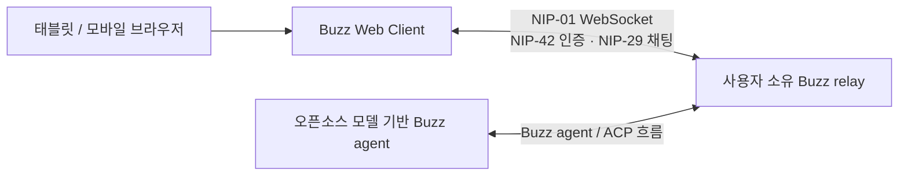

# Buzz Web Client

갤럭시탭을 비롯한 모바일 브라우저에서 앱 설치 없이 Buzz 채널을 읽고 메시지를 보낼 수 있도록 만든 비공식 웹 클라이언트 MVP입니다.

> [!IMPORTANT]
> 이 프로젝트는 Block, Inc.의 공식 Buzz 클라이언트가 아닙니다. 공개된 Buzz/Nostr 프로토콜을 기반으로 만든 독립적인 오픈소스 실험입니다.

## 기획 의도

Buzz의 주요 클라이언트는 데스크톱과 모바일 앱입니다. 하지만 앱 설치가 제한된 태블릿이나 관리형 기기에서도 기본적인 채널 대화가 필요할 수 있습니다. 이 프로젝트는 다음 질문에서 시작했습니다.

> “Buzz relay에 브라우저로 직접 연결해 채널을 보고 메시지를 보낼 수 없을까?”

전체 데스크톱 기능을 한 번에 옮기기보다, 실제 사용에 필요한 최소 흐름에 집중했습니다.

- 별도 앱 설치 없이 URL로 접속
- 사용자가 소유한 Buzz relay에 직접 연결
- 채널 목록과 최근 대화 확인
- 실시간 메시지 수신 및 전송
- 태블릿과 모바일 화면에 맞는 반응형 UI
- 특정 AI API나 상용 모델에 종속되지 않는 구조

## 현재 구현 범위

- NIP-42 challenge-response 인증
- NIP-29 `kind:39000` 기반 채널 탐색
- `kind:9`, `kind:40002` 채널 메시지 조회 및 실시간 구독
- `kind:9` 메시지 작성과 Schnorr 서명
- 스레드 답장(NIP-10 `e` 태그)과 답장 맥락 표시
- 반응(NIP-25 `kind:7`) 추가·취소와 이모지 카운트 표시
- `kind:0` 사용자 프로필 표시
- `kind:39002` 채널 멤버 수 표시
- `nsec` 또는 64자리 hex 개인키 입력
- 모바일 채널 드로어와 반응형 채팅 UI
- relay URL만 로컬 저장, 개인키는 탭 메모리에서만 사용

아직 구현하지 않은 기능은 DM, 파일 첨부, 메시지 수정·삭제, 멘션 자동완성입니다.

## 동작 구조



브라우저는 relay와 WebSocket으로 직접 통신합니다. 별도의 애플리케이션 백엔드나 중앙 메시지 서버를 두지 않습니다.

## 오픈소스 모델 연동

이 클라이언트는 LLM을 직접 호출하지 않으며 모델에 종속되지 않습니다. Ollama, vLLM 등으로 구동하는 오픈소스 모델 에이전트를 Buzz relay에 참여시키면 사람과 에이전트의 메시지가 동일한 채널 이벤트로 전달됩니다.

즉, 모델 연동은 웹 클라이언트가 아니라 Buzz agent/harness 계층에서 담당합니다. 이 저장소의 역할은 사용자가 그 대화를 브라우저에서 읽고 참여할 수 있게 하는 것입니다.

## 보안 원칙

- 개인키는 React 상태와 메모리에서만 사용하며 `localStorage`나 서버에 저장하지 않습니다.
- 연결 해제 또는 페이지 종료 시 보관 중인 키 바이트를 지웁니다.
- NIP-42 인증 이벤트와 발신 메시지는 브라우저에서 서명합니다.
- HTTPS로 배포한 페이지에서는 브라우저 보안 정책상 `wss://` relay만 연결할 수 있습니다.
- 공개 또는 공유 기기에서는 개인키 직접 입력을 권장하지 않습니다.

이 MVP는 편의성과 구조 검증을 위한 단계입니다. 운영 환경에서는 NIP-07 서명 확장, 하드웨어 키 또는 안전한 키 위임 방식을 추가하는 것이 좋습니다.

## 시작하기

### 요구 사항

- Node.js 22.13 이상
- 접근 가능한 Buzz relay
- 해당 relay에서 사용할 수 있는 Nostr 개인키

### 실행

```bash
npm install
npm run dev
```

브라우저에서 `http://localhost:3000`을 열고 Buzz relay URL과 개인키를 입력합니다.

### 빌드

```bash
npm run build
```

Cloudflare Workers 호환 vinext 빌드가 생성됩니다.

## 기술 구성

- React 19
- TypeScript
- vinext / Vite
- Cloudflare Workers runtime
- `nostr-tools` 2.23
- 순수 CSS 기반 반응형 UI

## 참고 문서

- [Buzz repository](https://github.com/block/buzz)
- [Buzz Nostr interoperability](https://github.com/block/buzz/blob/main/NOSTR.md)
- [Buzz architecture](https://github.com/block/buzz/blob/main/ARCHITECTURE.md)
- [Nostr NIPs](https://github.com/nostr-protocol/nips)

## 라이선스

[MIT](./LICENSE)
